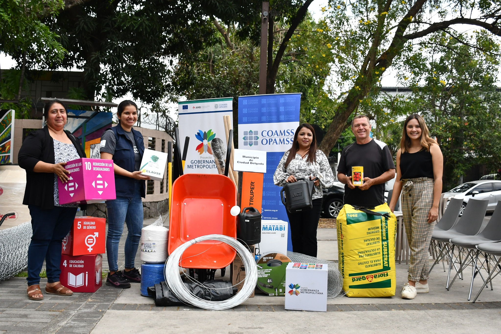
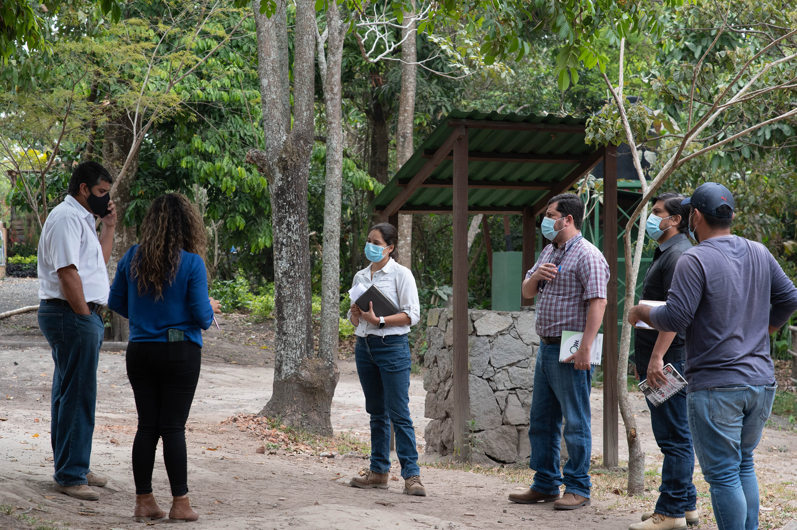

This publication presents a methodological framework for the implementation of community gardens, focusing on strengthening technical and pedagogical capacities in the development of integrated and community-based agro-food systems.

Developed as part of OPAMSS initiatives, the guide supports municipalities and communities in designing and implementing training processes that promote sustainable food production, environmental awareness, and local resilience.



## Overview

Community gardens play an important role in strengthening local food systems and fostering community participation. This guide provides a structured approach for implementing training processes that combine technical knowledge with participatory methods.

It serves as a practical tool for supporting community-based initiatives that integrate environmental, social, and productive dimensions.

### My Contribution

- Development of methodological framework and training structure  
- Support in designing pedagogical approaches for community engagement  
- Contribution to content development and implementation strategies
  
## Full Publication

[View full document](https://opamss.org.sv/wp-content/uploads/2022/03/GuiaHuertos.pdf)

## Gallery

## Context

This work was developed as part of OPAMSS efforts to promote sustainable urban development through community-based initiatives, supporting local capacity building and the implementation of nature-based solutions in the San Salvador Metropolitan Area.
