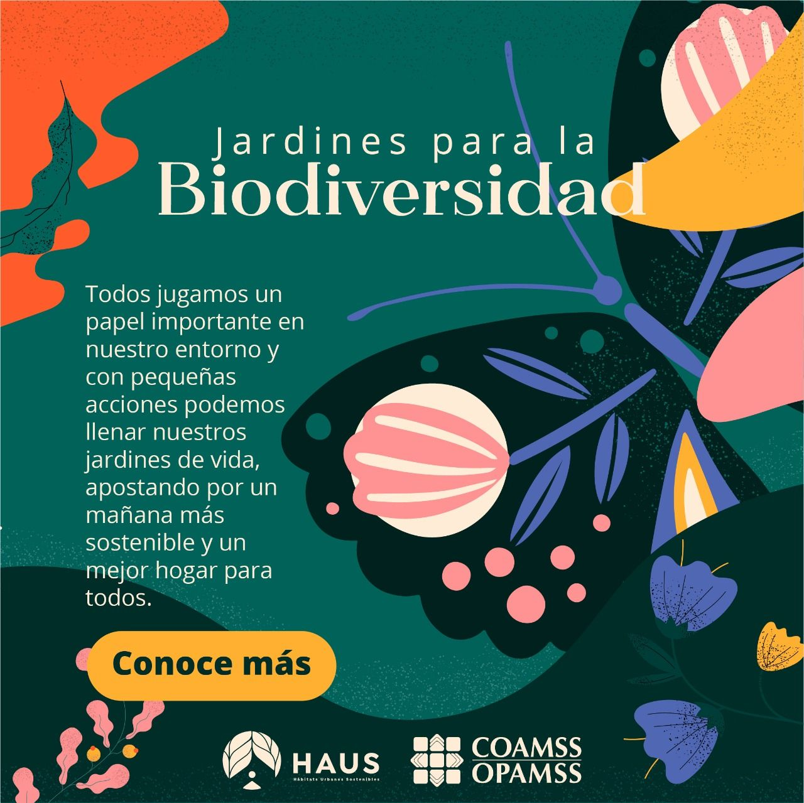
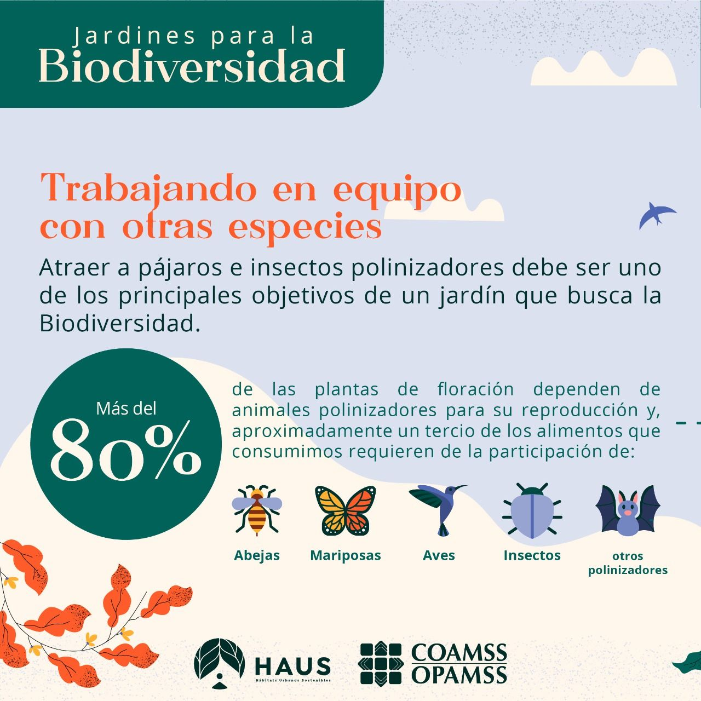
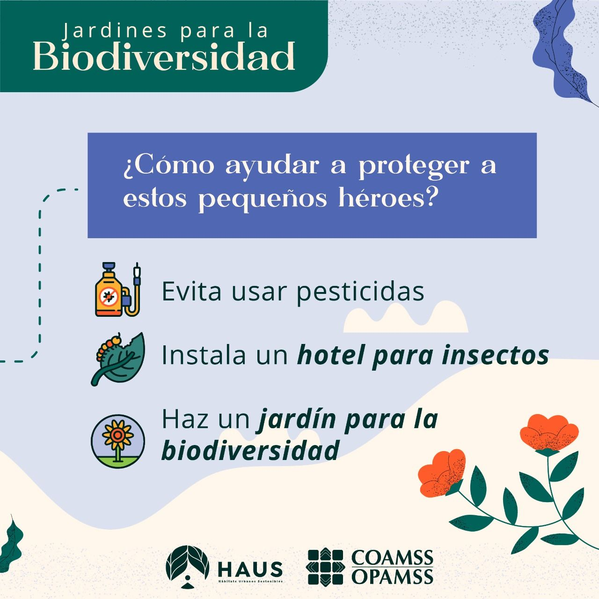

This publication presents an illustrated guide for selecting native and melliferous plant species that support pollinator populations in urban environments.

Developed as part of OPAMSS initiatives, the guide provides practical recommendations for designing green spaces that enhance biodiversity and ecosystem services in the San Salvador Metropolitan Area. It focuses on species selection based on ecological function, adaptability, and their role in supporting pollinator insects.



## Overview

Urban green spaces play an important role in maintaining ecological balance within cities. This guide was developed to support the integration of biodiversity into urban design by promoting the use of native and pollinator-friendly plant species.

It serves as a practical tool for municipalities, planners, and communities interested in implementing nature-based solutions through vegetation design.

## My Contribution

- Development of technical content and species selection criteria  
- Support in structuring the guide for practical implementation  
- Contribution to visual and communication materials  

## Full Publication

[View full document](https://opamss.org.sv/wp-content/uploads/2023/01/Jardines-para-la-Biodiversidad.pdf)

## 🖼️ Outreach and Communication

As part of this work, I shared insights on the importance of native and melliferous plant species through public communication.

Native flowering plants play a key role beyond their aesthetic value, contributing to biodiversity conservation by supporting pollinators such as bees and other insects. These species provide essential sources of nectar and pollen, helping sustain ecological interactions within urban environments.

Through this communication effort, the goal was to raise awareness about the role of vegetation in urban ecosystems and promote the use of native species in landscape design and environmental planning.

## Context

This work was developed as part of OPAMSS efforts to strengthen urban environmental planning and promote nature-based solutions across the San Salvador Metropolitan Area, supporting biodiversity conservation and sustainable city development.

