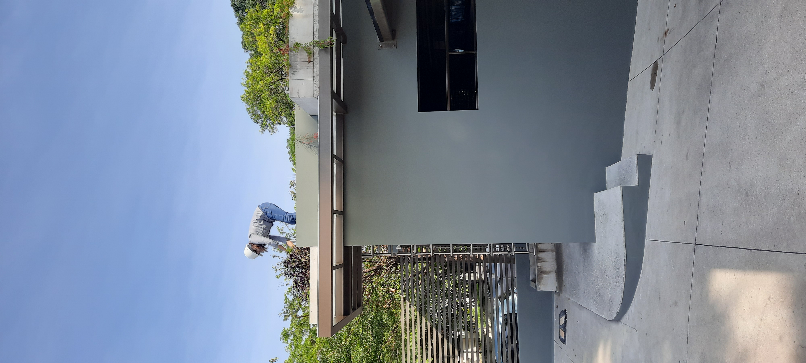

Green roofs were implemented as part of institutional sustainability strategies, integrating vegetation into built environments to improve stormwater management, reduce urban heat, and enhance biodiversity.

## Overview

This project explores how green roofs can function as nature-based solutions within urban systems. The design focused on selecting plant species adapted to local conditions and optimizing performance in terms of water retention and thermal regulation.

## My Role

- Design and planning of green roof systems  
- Plant selection for local conditions  
- Support in implementation and monitoring

## Project

## Video



<!--more-->
