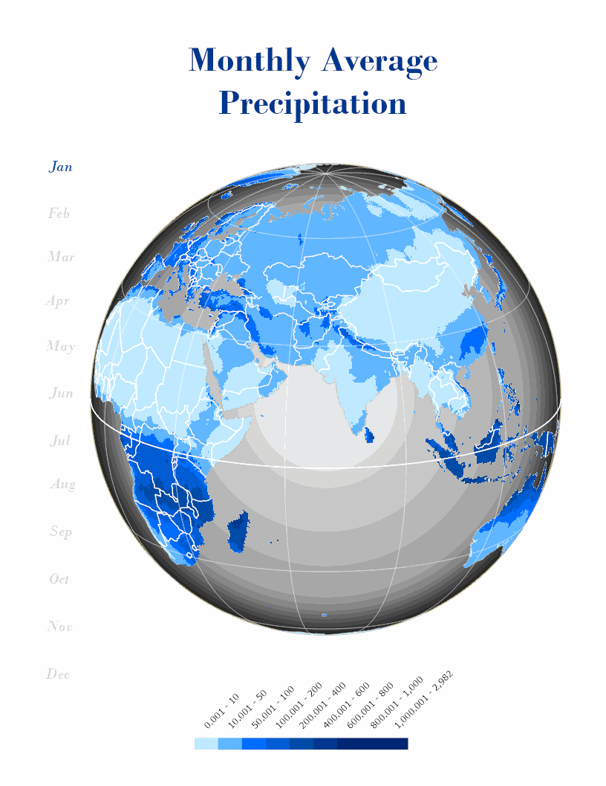

This project was developed as part of a geospatial visualization assignment focused on creating animated climate maps. The workflow involved processing global precipitation raster data, applying consistent symbology across monthly datasets, and designing a globe-style map layout in ArcGIS Pro.

Individual map frames were exported and combined into an animated GIF to visualize seasonal changes in precipitation. The final result emphasizes how cartographic design and animation can be used to communicate temporal environmental patterns.

**Credits:**  
Activity based on a tutorial by Nelson Schäfer / NelloMaps.  
Data sources: WorldClim and Natural Earth.  
GIF creation script adapted from course materials (Felipe Sanchez, 2025).

