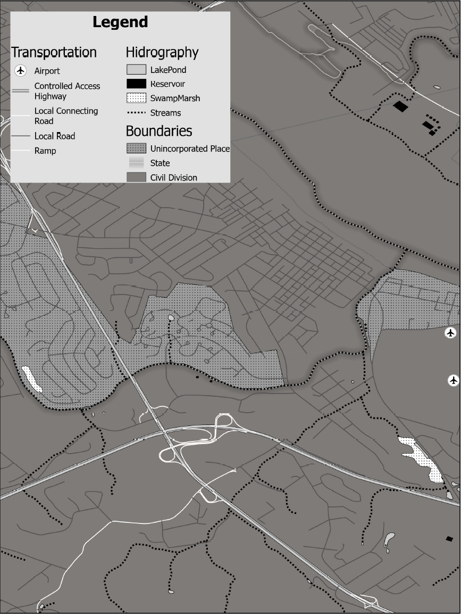
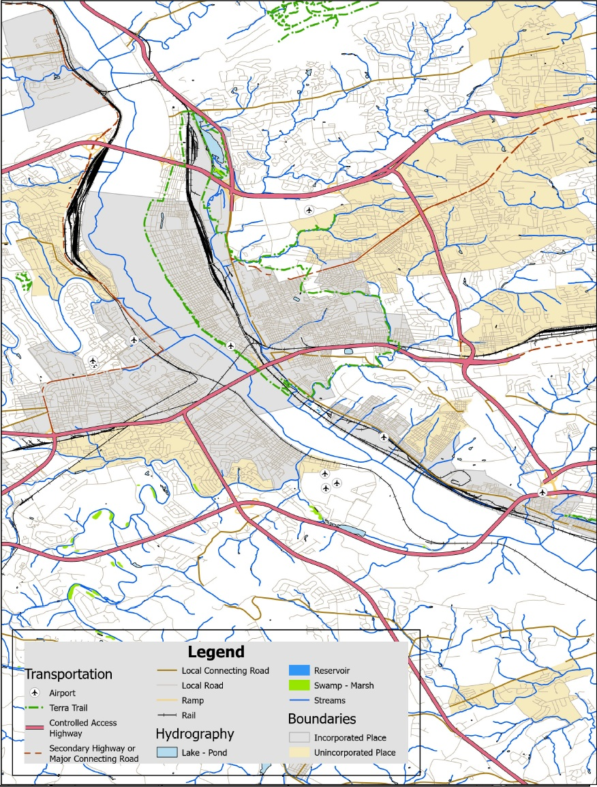
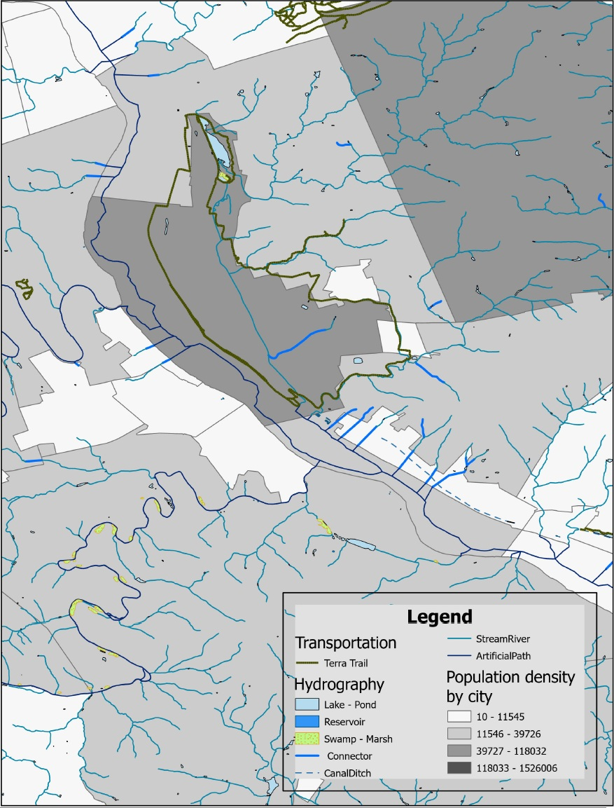

This project focuses on designing basemaps at multiple scales, exploring how cartographic choices affect visual hierarchy and readability.

## Map Variations

### Large Scale (1:24,000)
This map highlights different transportation features, including roads, railways, trails, and airports within the same area. It is designed to explore how transportation systems connect across the city and where different modes could interact. Waterbodies and flowlines are included to suggest potential for water-based transportation and tourism.

Because the map is in grayscale, the design focuses on contrast rather than color. Major features such as highways, railways, and waterbodies are shown with darker and heavier symbols, while local roads and background elements are lighter to maintain a clear visual hierarchy.

### Small Scale (1:100,000)
This map is intended for a general audience and provides a broader view of transportation patterns across a larger area. At this scale, the focus shifts from detail to overall spatial relationships between different transportation features.

Color is used to distinguish categories, with brown and terracotta tones representing transportation networks, and green and blue tones representing hydrological features. Visual hierarchy is achieved through variations in line weight, color intensity, and line styles, with major roads emphasized more strongly than local ones.

### Small Scale (1:100,000, Full Color)
This map focuses on surface water networks, including streams and waterbodies, combined with trail infrastructure and population density. It explores how natural features and recreational spaces intersect with urban areas.

The map is designed with a potential application in mind, such as a web or mobile platform where users could identify nearby greenways or water-based recreational areas. It also highlights opportunities for enhancing green–blue corridors to support ecosystem services and urban resilience.

